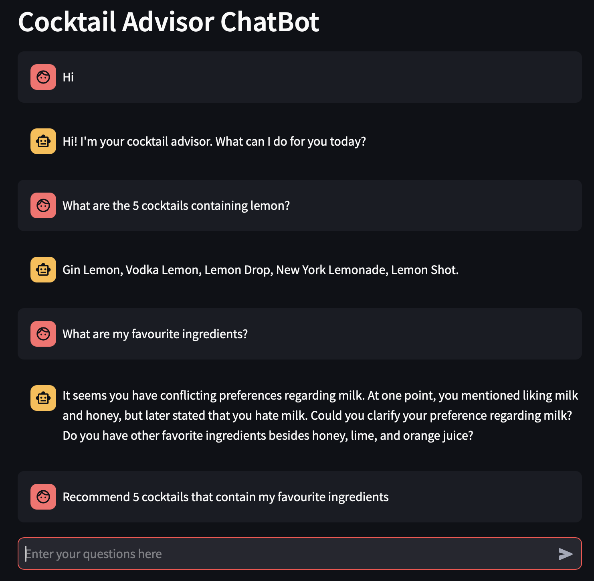
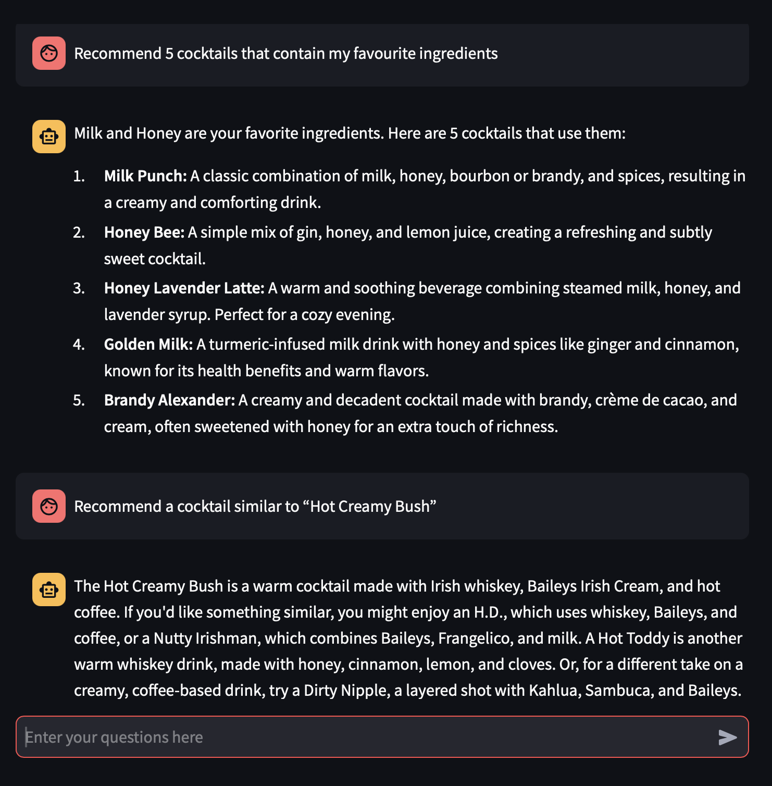

# Cocktail Advisor ChatBot

This project is a Python-based chat application that demonstrates the use of a **Retrieval-Augmented Generation (RAG)** system. It combines the capabilities of a large language model (LLM) with a vector database for retrieving relevant data. Users can interact with the chatbot to receive recommendations and information about cocktails, tailored based on their preferences.

## Features
- **Vector Database Integration:** Uses Pinecone to store and retrieve cocktail data and user memories data efficiently.
- **LLM-based Responses:** Utilizes Google’s Generative AI for generating conversational and context-aware answers.
- **Streamlit Interface:** Simple, interactive web interface.

## How to Run the Project Locally

### Prerequisites
1. Python 3.9 or higher
2. An account on [Google Cloud](https://cloud.google.com/) for API access.
3. An account on [Pinecone](https://www.pinecone.io/) to set up the vector database.

### Setup Instructions

1. Clone the Repository:
   ```bash
   git clone https://github.com/Liubavaa/CocktailAdvisorChat.git
   cd CocktailAdvisorChat
   ```

2. Create a Virtual Environment and Activate it:
   ```bash
   python -m venv env
   source env/bin/activate # On Windows: env\Scripts\activate
   ```

3. Install Dependencies:
   ```bash
   pip install -r requirements.txt
   ```

4. Set Environment Variables:
   Create a `.env` file in the project root directory with the following variables:
   ```env
   GOOGLE_API_KEY=<your_google_api_key>
   PINECONE_API_KEY=<your_pinecone_api_key>
   ```

5. Run the Application:
   ```bash
   streamlit run app.py
   ```
   Access the chatbot through the link generated by Streamlit.

## Summary of Results and Thought Process

### Final Solution
The implemented solution uses Google’s **gemini-1.5-pro** LLM and **GoogleGenerativeAIEmbeddings** to generate high-quality responses and embeddings. Pinecone serves as the vector database to store and retrieve documents efficiently. The chatbot uses the LangChain framework for the RAG system, incorporating:
- A `cocktails` vector store for cocktail data.
- A `user-memories` vector store for storing and retrieving user preferences.
- An extraction model to identify user preferences from input text and enhance personalization.

### Thought Process

1. **Problem Understanding:** The goal was to build a conversational system that provides cocktail recommendations while storing user preferences for personalized responses.

2. **Experimentation with Variants:** Several alternatives were tested during development:
   - **Data Handling:**
     - *DataFrameLoader* and *CharacterTextSplitter* were explored for data ingestion but led to inefficiencies or poorer embedding quality compared to the simple `CSVLoader`.
   - **Self-Created Queuing Engine:** Implemented a queuing system with metadata descriptions but found it less performant and harder to integrate than a simple retriever.
   - **Vector Database Options:**
     - Evaluated FAISS but opted for Pinecone due to its faster performance and easier (and sometimes the only one supported) integration with LangChain.
   - **Model Variants:** Tested simpler LLMs but found that Google’s gemini-1.5-pro model provided more contextually accurate answers.

3. **Reasoning Behind Final Approach:**
   - The use of an agent (via LangChain’s `create_react_agent`) allowed for more robust query handling compared to simple chains.
   - The implemented user preference extraction layer allows to save only the necessary information from the user input, but requires an additional call to llm for detection, so base version saves all user input.

### Usage Example


